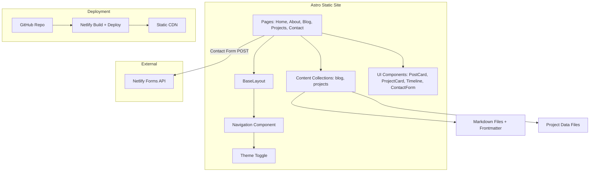

# Design Document

## Overview

Portfolio V3 is a static developer portfolio and blog for Ollie, built with Astro and Tailwind CSS, deployed to Netlify. The site has five page types (Home, About, Blog Index, Blog Post, Projects, Contact) with dark-mode-first theming, responsive layout, and Netlify Forms for contact submissions.

The architecture is intentionally simple: Astro pages, a shared layout, reusable components, content collections for blog posts and projects, and zero backend beyond Netlify's form handling.

## Architecture



The project follows Astro's standard file-based routing:

```
src/
├── layouts/
│   └── BaseLayout.astro        # Shared HTML shell, head, nav, footer
├── components/
│   ├── Navigation.astro         # Site-wide nav bar
│   ├── ThemeToggle.astro        # Dark/light mode switch
│   ├── PostCard.astro           # Blog post preview card
│   ├── ProjectCard.astro        # Project display card
│   ├── Timeline.astro           # Career timeline on About page
│   └── ContactForm.astro        # Netlify-powered contact form
├── pages/
│   ├── index.astro              # Home page
│   ├── about.astro              # About page
│   ├── blog/
│   │   ├── index.astro          # Blog index
│   │   └── [...slug].astro      # Dynamic blog post pages
│   ├── projects.astro           # Projects page
│   └── contact.astro            # Contact page
├── content/
│   ├── blog/                    # Markdown blog posts
│   │   ├── i-love-vibe-coding.md
│   │   └── google-kill-laptop.md
│   └── projects/                # Project data (JSON or YAML)
│       └── projects.json
├── styles/
│   └── global.css               # Tailwind directives + custom styles
└── content.config.ts            # Content collection schemas
```

No additional frameworks, state management, or build tools beyond what Astro and Tailwind provide out of the box.

## Components and Interfaces

### BaseLayout

The shared layout wrapping every page. Responsible for:
- HTML `<head>` with meta tags, Tailwind stylesheet, and theme initialization script
- `<Navigation />` component
- `<main>` slot for page content
- `<footer>` with copyright

Props:
- `title: string` — page title for `<title>` tag
- `description?: string` — meta description

### Navigation

Rendered inside BaseLayout on every page. Contains:
- Site name/logo linking to Home
- Links: Home, About, Blog, Projects, Contact
- ThemeToggle component
- Responsive: collapses to a hamburger or simplified layout on mobile

### ThemeToggle

A button that toggles a `dark` class on `<html>`. On page load, a small inline script reads `localStorage` for the saved preference and applies it before paint (to avoid flash). Clicking the toggle:
1. Toggles the `dark` class on `<html>`
2. Saves the new preference to `localStorage`

Tailwind's `darkMode: 'class'` strategy is used.

### PostCard

Displays a blog post preview. Used on Home page (latest posts) and Blog Index.

Props:
- `title: string`
- `date: Date`
- `description: string`
- `tags: string[]`
- `slug: string`

Renders a clickable card linking to `/blog/{slug}`.

### ProjectCard

Displays a single project entry.

Props:
- `title: string`
- `description: string`
- `techTags: string[]`
- `repoUrl?: string`
- `liveUrl?: string`
- `image?: string`

External links open in a new tab (`target="_blank" rel="noopener noreferrer"`).

### Timeline

A simple vertical timeline component for the About page showing career milestones. Takes an array of timeline entries:

```typescript
interface TimelineEntry {
  year: string;
  title: string;
  description: string;
}
```

### ContactForm

An HTML form with `data-netlify="true"` attribute for Netlify Forms integration. Fields:
- Name (text, required)
- Email (email, required)
- Message (textarea, required)

Client-side: on successful submission, shows a confirmation message. On failure, shows an error message. No JavaScript framework needed — a simple fetch POST with form data, then toggle visibility of success/error elements.

## Data Models

### Blog Post Frontmatter Schema

Defined in `content.config.ts` using Astro's content collection API:

```typescript
import { defineCollection, z } from 'astro:content';

const blog = defineCollection({
  type: 'content',
  schema: z.object({
    title: z.string(),
    date: z.date(),
    description: z.string(),
    tags: z.array(z.string()),
  }),
});
```

Each blog post is a `.md` file in `src/content/blog/` with this frontmatter.

### Project Entry Schema

Projects stored as a JSON file (`src/content/projects/projects.json`) or as a content collection. Using a simple JSON array:

```typescript
interface ProjectEntry {
  title: string;
  description: string;
  techTags: string[];
  repoUrl?: string;
  liveUrl?: string;
  image?: string;
}
```

Initial entries: Maxwell Mysteries, Director's Portfolio, Actor's Portfolio, Task Glitch.

### Theme Preference

Stored in `localStorage` under key `"theme"` with values `"dark"` or `"light"`. Default: `"dark"`.


## Correctness Properties

*A property is a characteristic or behavior that should hold true across all valid executions of a system — essentially, a formal statement about what the system should do. Properties serve as the bridge between human-readable specifications and machine-verifiable correctness guarantees.*

### Property 1: Latest posts are sorted by date descending

*For any* set of blog posts in the content collection, the Home page's "latest posts" section should display posts sorted by date in descending order (newest first), and the number of displayed posts should not exceed the configured limit.

**Validates: Requirements 1.2**

### Property 2: Post card links match slugs

*For any* blog post rendered as a PostCard (on the Home page or Blog Index), the card's link href should equal `/blog/{slug}` where `{slug}` is the post's collection slug.

**Validates: Requirements 1.4, 4.3**

### Property 3: Blog frontmatter fields are displayed

*For any* blog post with valid frontmatter (title, date, description, tags), when rendered on the Blog Index or Blog Post page, all four frontmatter fields should be present in the rendered output.

**Validates: Requirements 3.1, 4.2, 5.2**

### Property 4: Blog Index displays all posts

*For any* set of blog posts in the content collection, the Blog Index page should display exactly as many post entries as exist in the collection — no posts omitted, no extras.

**Validates: Requirements 4.1**

### Property 5: AI attribution on every post

*For any* blog post page, the rendered output should contain the text "Human written, AI assisted."

**Validates: Requirements 5.3**

### Property 6: References section when references exist

*For any* blog post whose markdown content includes references, the rendered Blog Post page should contain a references section. For any blog post without references, no references section should appear.

**Validates: Requirements 5.4**

### Property 7: Project entries display all required fields

*For any* project entry in the data source, the Projects page should render the entry's title, description, and tech tags. Where the entry includes an image, the rendered output should include an image element.

**Validates: Requirements 6.1, 6.2, 6.3**

### Property 8: Project links open in new tab

*For any* project link (repo or live demo) rendered on the Projects page, the anchor element should have `target="_blank"` and `rel="noopener noreferrer"` attributes.

**Validates: Requirements 6.5**

### Property 9: No email address on contact page

*For any* rendering of the Contact page, the output should not contain a string matching an email address pattern.

**Validates: Requirements 7.6**

### Property 10: Navigation present with correct links on every page

*For any* page on the site, the rendered output should contain a navigation element with links to Home (`/`), About (`/about`), Blog (`/blog`), Projects (`/projects`), and Contact (`/contact`).

**Validates: Requirements 8.1, 8.4**

### Property 11: Theme toggle round-trip

*For any* initial theme state (dark or light), activating the Theme Toggle should switch to the opposite theme, and the new preference should be persisted to localStorage so that it survives page navigation.

**Validates: Requirements 9.2, 9.3**

## Error Handling

### Contact Form

- **Submission failure**: If the Netlify Forms POST fails (network error, server error), display a user-friendly error message in place of the form or below it. Do not lose the user's input — keep the form fields populated.
- **Validation**: HTML5 `required` attributes on name, email, and message fields. The email field uses `type="email"` for basic format validation. No custom JavaScript validation needed beyond what the browser provides.

### Content Collections

- **Invalid frontmatter**: Astro's content collection schema validation (via Zod) will throw build-time errors if a blog post has missing or invalid frontmatter fields. This is caught at build time, not runtime.
- **Missing images**: If a project entry references an image that doesn't exist, the build should still succeed. Use optional chaining or conditional rendering for the image field.

### Theme Toggle

- **localStorage unavailable**: If localStorage is blocked (private browsing in some browsers), the theme toggle should still work for the current page session. Wrap localStorage calls in a try/catch and fall back to in-memory state.

### Navigation

- **No special error handling needed**: Navigation is static HTML links. If a page doesn't exist, Astro's build will catch missing routes.

## Testing Strategy

### Unit Tests

Use Vitest (Astro's recommended test runner). Focus on:

- **Content schema validation**: Verify that sample frontmatter objects pass/fail the Zod schema as expected.
- **Data helpers**: Test any utility functions (e.g., `getLatestPosts`, `sortByDate`, `formatDate`) with specific inputs and expected outputs.
- **Specific content existence**: Verify the two migrated blog posts exist. Verify the four required project entries exist.
- **Contact page**: Verify no email address pattern appears in the rendered output.
- **Edge cases**: Empty blog collection, project with no image, project with no live URL, contact form submission failure.

### Property-Based Tests

Use **fast-check** with Vitest. Minimum 100 iterations per property test.

Each property test must reference its design document property with a comment tag:

```
// Feature: portfolio-v3, Property {N}: {property title}
```

Property tests to implement:

1. **Latest posts ordering** — Generate random arrays of post objects with dates, run the sorting/slicing logic, verify output is sorted descending and within the limit.
2. **Post card links match slugs** — Generate random slug strings, verify the PostCard component produces an href of `/blog/{slug}`.
3. **Blog frontmatter fields displayed** — Generate random valid frontmatter objects, verify all fields appear in rendered output.
4. **Blog Index displays all posts** — Generate random-length arrays of posts, verify the index renders exactly that many entries.
5. **Project entries display required fields** — Generate random project entries (with and without optional image/liveUrl), verify all required fields appear and image appears only when provided.
6. **Project links open in new tab** — Generate random URLs, verify rendered anchor elements have `target="_blank"`.
7. **No email on contact page** — Generate random page content, verify no email pattern matches.
8. **Navigation links on every page** — Generate random page paths, verify nav contains all five expected links.
9. **Theme toggle round-trip** — Generate random initial states (dark/light), toggle, verify state flips and localStorage updates.

### What We Don't Test

- Visual/layout correctness (responsive design, typography) — these require manual review or visual regression tools, not unit/property tests.
- Netlify deployment pipeline — infrastructure concern.
- Astro framework behavior (content collection auto-discovery, static output) — trust the framework.
- Accessibility — requires manual testing with assistive technologies.
